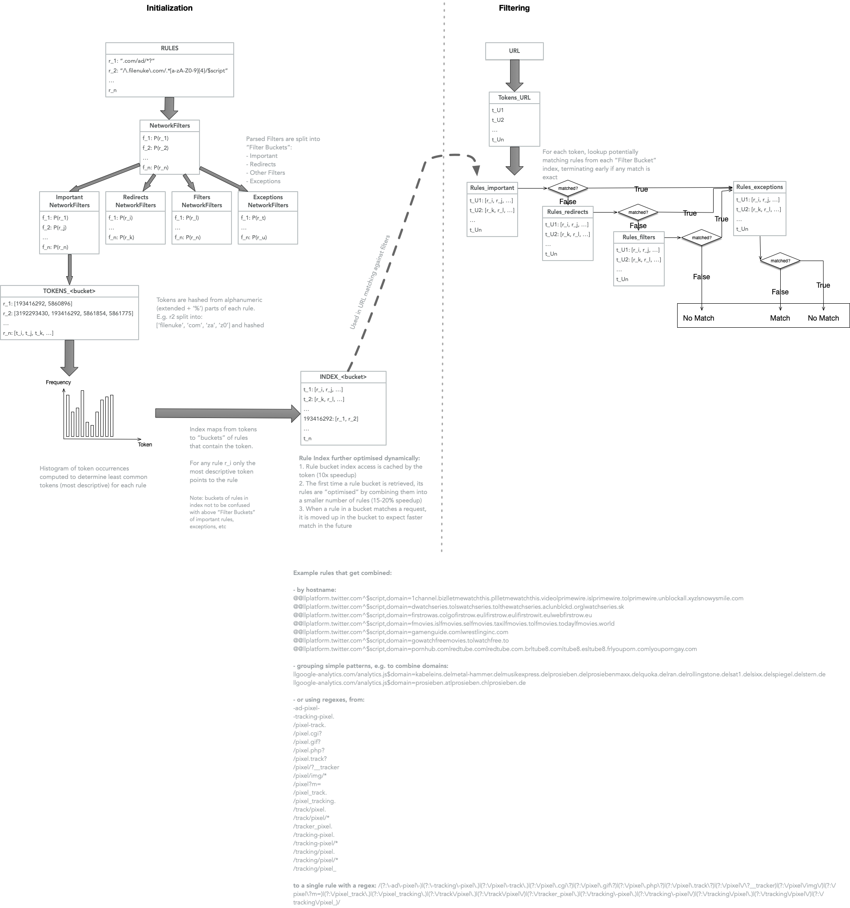

# Ad Block engine in Rust

[](https://docs.rs/adblock)
[](https://crates.io/crates/adblock)
[](https://www.npmjs.com/package/adblock-rs)


Native Rust module for Adblock Plus syntax (e.g. EasyList, EasyPrivacy) filter parsing and matching.

It uses a tokenisation approach for quickly reducing the potentially matching rule search space against a URL.

The algorithm is inspired by, and closely follows the algorithm of [uBlock Origin](https://github.com/gorhill/uBlock) and [Cliqz](https://github.com/cliqz-oss/adblocker).

Somewhat graphical explanation of the algorithm:



## Demo

Demo use in Rust:

```rust
use adblock::engine::Engine;
use adblock::lists::{FilterSet, ParseOptions};

fn main() {
    let rules = vec![
        String::from("-advertisement-icon."),
        String::from("-advertisement-management/"),
        String::from("-advertisement."),
        String::from("-advertisement/script."),
    ];

    let mut filter_set = FilterSet::new(true);
    filter_set.add_filters(&rules, ParseOptions::default());

    let blocker = Engine::from_filter_set(filter_set, true);
    let blocker_result = blocker.check_network_urls("http://example.com/-advertisement-icon.", "http://example.com/helloworld", "image");

    println!("Blocker result: {:?}", blocker_result);
}
```

## Node.js module demo

Note the Node.js module has overheads inherent to boundary crossing between JS and native code.

```js
const AdBlockClient = require('adblock-rs');
let el_rules = fs.readFileSync('./data/easylist.to/easylist/easylist.txt', { encoding: 'utf-8' }).split('\n');
let ubo_unbreak_rules = fs.readFileSync('./data/uBlockOrigin/unbreak.txt', { encoding: 'utf-8' }).split('\n');
let rules = el_rules.concat(ubo_unbreak_rules);
let resources = AdBlockClient.uBlockResources('uBlockOrigin/src/web_accessible_resources', 'uBlockOrigin/src/js/redirect-engine.js', 'uBlockOrigin/assets/resources/scriptlets.js');

const filterSet = new AdBlockClient.FilterSet(true);
filterSet.addFilters(rules);
const client = new AdBlockClient.Engine(filterSet, true);
client.useResources(resources);

const serializedArrayBuffer = client.serializeRaw(); // Serialize the engine to an ArrayBuffer

console.log(`Engine size: ${(serializedArrayBuffer.byteLength / 1024 / 1024).toFixed(2)} MB`);

console.log("Matching:", client.check("http://example.com/-advertisement-icon.", "http://example.com/helloworld", "image"))
// Match with full debuging info
console.log("Matching:", client.check("http://example.com/-advertisement-icon.", "http://example.com/helloworld", "image", true))
// No, but still with debugging info
console.log("Matching:", client.check("https://github.githubassets.com/assets/frameworks-64831a3d.js", "https://github.com/AndriusA", "script", true))
// Example that inlcludes a redirect response
console.log("Matching:", client.check("https://bbci.co.uk/test/analytics.js", "https://bbc.co.uk", "script", true))
```

## Optional features

### CSS validation during rule parsing

When parsing cosmetic filter rules, it's possible to include a built-in implementation of CSS validation (through the [selectors](https://crates.io/crates/selectors) and [cssparser](https://crates.io/crates/cssparser) crates) by enabling the `css-validation` feature. This will cause `adblock-rust` to reject cosmetic filter rules with invalid CSS syntax.

### Content blocking format translation

Enabling the `content-blocking` feature gives `adblock-rust` support for conversion of standard ABP-style rules into Apple's [content-blocking format](https://developer.apple.com/documentation/safariservices/creating_a_content_blocker), which can be exported for use on iOS and macOS platforms.

### External domain resolution

By default, `adblock-rust` ships with a built-in domain resolution implementation (through the [addr](https://crates.io/crates/addr) crate) that will generally suffice for standalone use-cases. For more advanced use-cases, disabling the `embedded-domain-resolver` feature will allow `adblock-rust` to use an external domain resolution implementation instead. This is extremely useful to reduce binary bloat and improve consistency when embedding `adblock-rust` within a browser.

### Parsing resources from uBlock Origin's formats

`adblock-rust` uses uBlock Origin-compatible resources for scriptlet injection and redirect rules.
The `resource-assembler` feature allows `adblock-rust` to parse these resources directly from the file formats used by the uBlock Origin repository.

### Thread safety

The `object-pooling` and `unsync-regex-caching` features enable optimizations for rule matching speed and the amount of memory used by the engine.
These features can be disabled to make the engine `Send + Sync`, although it is recommended to only access the engine on a single thread to maintain optimal performance.
